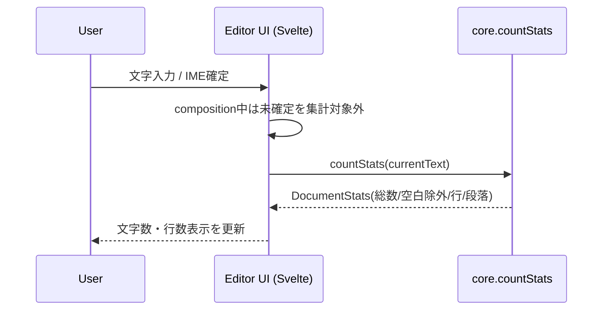
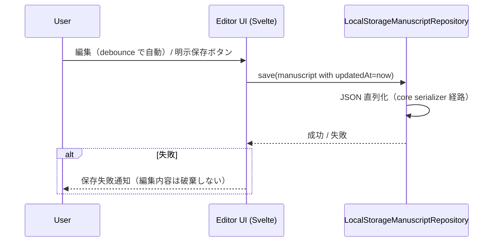
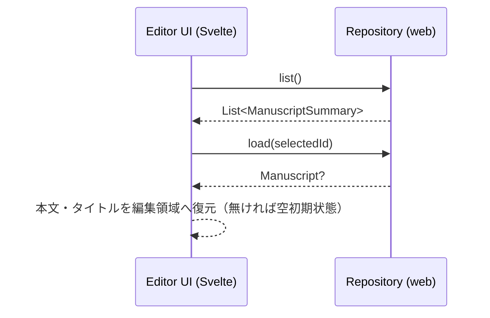

# Web Design — Web / PWA アダプタ

> 対象: [requirements.md](./requirements.md) の US-001〜008 / FR-004〜008 を満たす技術設計。共有ロジックは [../core/design.md](../core/design.md) を参照。
> 型名・UI 文言・PWA 名称は「仮」（最終決定はユーザー主導）。

## Overview

web は **TypeScript + Vite + Svelte 5** で実装する DOM ベースの最小エディタ UI と、LocalStorage による `ManuscriptRepository` 実装、PWA 資産（vite-plugin-pwa が生成）を持つ。保存モデル・`countStats`・Repository port は core（[../core/](../core/design.md)）を `js(IR)` ライブラリ＋ `.d.mts` 経由で型付き消費する。これにより「書く→保存→開き直す」をオフラインで成立させる。

選定理由（要約）: 日本語 IME・将来の縦書き/ルビは実 DOM/CSS を要求し、canvas 描画系（Compose/Wasm）は不適。Kotlin は共有 core に集中し、Web UI は DOM 制御に強い軽量フロント（Svelte）で受ける。

## Architecture

```
noveditor/
├─ core/                          # 共有ロジック（別 spec）。js library + .d.mts を出力
└─ web/                           # Web/PWA アダプタ（TypeScript + Vite + Svelte 5）
   ├─ package.json / vite.config.ts   # vite-plugin-pwa 設定（manifest/SW 自動生成）
   ├─ tsconfig.json
   ├─ index.html
   ├─ public/                     # アイコン等（仮）
   └─ src/
      ├─ main.ts / App.svelte
      ├─ editor/Editor.svelte     # 編集領域・タイトル・統計
      ├─ list/ManuscriptList.svelte
      ├─ repository/LocalStorageManuscriptRepository.ts
      └─ state/                   # Svelte store（編集状態・自動保存）
```

> `web/` は Node/pnpm 等のツールチェーンを自身で持ち、Gradle ビルドとは分離。core 出力をローカルリンク（または publish）した npm パッケージとして消費する。

### Components

- **core 消費 (web)**: core の `@JsExport` 公開 API（`countStats`・モデル・`ManuscriptRepository` 型）を `.d.mts` 経由で型付き import。
- **`LocalStorageManuscriptRepository` (web)**: `ManuscriptRepository`(port) の web 実体。JSON 直列化で LocalStorage に保存。
- **Editor UI (web, Svelte)**: 編集領域・タイトル入力欄・統計表示・原稿一覧・新規/切替/削除・明示保存。
- **PWA shell (web)**: vite-plugin-pwa が生成する manifest・Service Worker（アプリシェル precache）・登録。

## Data Flow

### 入力 → 統計更新（US-001 / US-002）



### 保存（US-003・自動＋明示）



> **自動保存と明示保存は同一の `save` 経路**を通る。自動は本文・タイトル編集の無操作時間後（debounce）にトリガ、明示は保存ボタンで即時。`updatedAt=now` の `now` と新規原稿の `id` は **web アダプタが採番して注入**（`crypto.randomUUID()` / `Date.now()`）。

### 起動・読み出し・切替・削除（US-004 / US-005 / US-008）



> **起動時の既定表示**は `updatedAt` 最大の原稿（US-004）。一覧からの選択・新規作成で `selectedId` を切り替える。**削除**は `delete(id)` 後、現在編集中なら別原稿（無ければ空初期状態）へ遷移（US-008）。

## Web Adapter Design（TypeScript + Vite + Svelte 5）

- **core の消費**: core を `js(IR){ browser() }` で `binaries.library()` 出力し、`@JsExport` 公開 API に対し `generateTypeScriptDefinitions()` で `.d.mts` を生成。web は npm 依存（ローカルリンク可）として import。`Manuscript` の JSON 直列化は core 側の serializer 経路を使う。
- **LocalStorageManuscriptRepository**: TypeScript で `ManuscriptRepository`(port) を実装。キー設計 `noveditor:manuscript:<id>`（原稿本体 JSON）＋ `noveditor:index`（Summary 配列）。例外は捕捉して呼び出し元へ失敗を返す。
  - **整合性（原子性が無い前提）**: `save` は **本文キーを先に書き、その後 index を更新**（途中失敗で index が本文を先行参照しない）。`delete` は本文キー削除 → index から該当 Summary 除去の順。起動時に index と本文キーを突合し、**本文を欠く index エントリは一覧から除外、index に無い孤立本文は読み飛ばし**（自己修復）。`title`/`updatedAt` は index と本文で重複保持するため、保存時は両者を必ず同値で更新する。
- **Editor UI（Svelte）**: 編集領域は DOM（`textarea` から開始、将来 `contenteditable` へ拡張余地。Svelte はきめ細かい更新で contenteditable と競合しにくい）＋ **タイトル入力欄**。`compositionstart`/`compositionend` を監視し、IME 未確定中は `countStats` 呼び出しをスキップ（US-001 AC）。本文・タイトル編集を **debounce で自動保存**し、**明示保存ボタン**も同一 `save` 経路。一覧からの **削除**（確認 UI・仮）・新規/切替の最小操作。新規作成時は **アダプタが `id`/`createdAt` を採番**（`crypto.randomUUID()` / `Date.now()`）。文言は仮。
- **PWA（vite-plugin-pwa）**: `manifest`（name/icons/`display: standalone`・**名称/アイコンは仮**）と Service Worker を vite-plugin-pwa（Workbox）で自動生成し、アプリシェルを precache（cache-first・オフライン起動）。SW 手書きは行わず、`registerType`/`globPatterns` で制御。HTTPS/localhost 前提。

> 将来のエディタエンジン（ルビ/縦書き）候補の **CodeMirror 6 / ProseMirror** はフレームワーク非依存のため、この Svelte 採用で縛られない（MVP は素の `textarea` ＋ core 統計）。

## Error Handling

| ケース | 戦略 |
|---|---|
| LocalStorage 保存失敗（容量超過等） | 例外捕捉 → UI に失敗通知、編集中バッファは保持（US-003 AC） |
| 破損 JSON / スキーマ不一致の読み出し | 当該原稿を読み飛ばし、一覧から除外候補としてログ。アプリは起動継続 |
| index と本文キーの不整合（本文欠落 / 孤立本文） | 起動時の突合で、本文を欠く index は一覧から除外、index に無い孤立本文は読み飛ばし（自己修復・ログ）。アプリは起動継続 |
| 保存データ皆無 | 空の初期状態（US-004 AC） |
| SW 登録失敗（非対応環境） | オンライン通常動作にフォールバック（PWA 機能のみ無効） |

## Security / Privacy Considerations

- MVP はサーバー無し・端末内完結。送信・外部保存なし。
- 入力は本文テキストのみ。直列化は core の kotlinx.serialization 由来の型安全な経路に限定。

## Testing Strategy

- **Unit (web)**: `LocalStorageManuscriptRepository` の save→load→list→delete ラウンドトリップ＋不整合自己修復（**Vitest** ＋ jsdom/happy-dom、LocalStorage はモック）。
- **core 消費の確認**: core 生成の `.mjs` ＋ `.d.mts` を型付き import し `countStats` が呼べること。
- **E2E（手動）**: 「書く→保存→再読み込みで復元」、複数原稿の作成・切替・削除、オフライン（DevTools offline）での起動と保存（US-003/004/005/006/008）。インストール可能性は Lighthouse / ブラウザのインストール導線で確認。

## Build / Toolchain

- `web/` は **TypeScript + Vite + Svelte 5**。`vite-plugin-pwa` で manifest/SW を生成。
- core は `./gradlew :core:jsBrowserProductionLibraryDistribution`（相当）の出力をローカルリンク（または publish）した npm パッケージとして依存。
- Node/pnpm 等を web 配下に持つ（Gradle ビルドとは分離、core 出力を web が消費）。

## Requirements トレーサビリティ

| 要件 | カバー箇所 |
|---|---|
| US-001 / FR-005 | Editor UI（Svelte/DOM・composition 監視） |
| US-002 / core FR-001 | `countStats`（core）/ 統計表示フロー（段落数は算出のみ・非表示） |
| US-003 / FR-004,007 ＋ core FR-002,003 | 保存フロー（自動＋明示・同一 save 経路）/ LocalStorage 実装 / Repository port / 直列化 |
| US-004 / US-005 | 起動・読み出し・切替フロー（既定は updatedAt 最大） |
| US-006 / FR-006 | PWA shell（vite-plugin-pwa：manifest / SW） |
| US-007 / FR-005 | タイトル入力欄（編集 → 保存対象） |
| US-008 / FR-008 | 削除操作 / Repository.delete / index 突合 |
